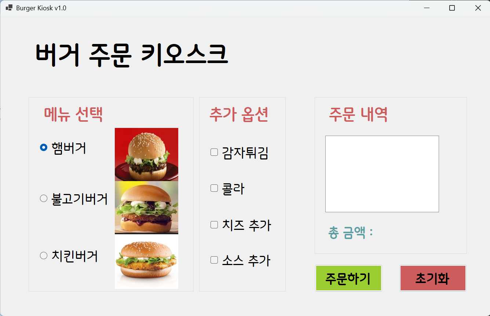
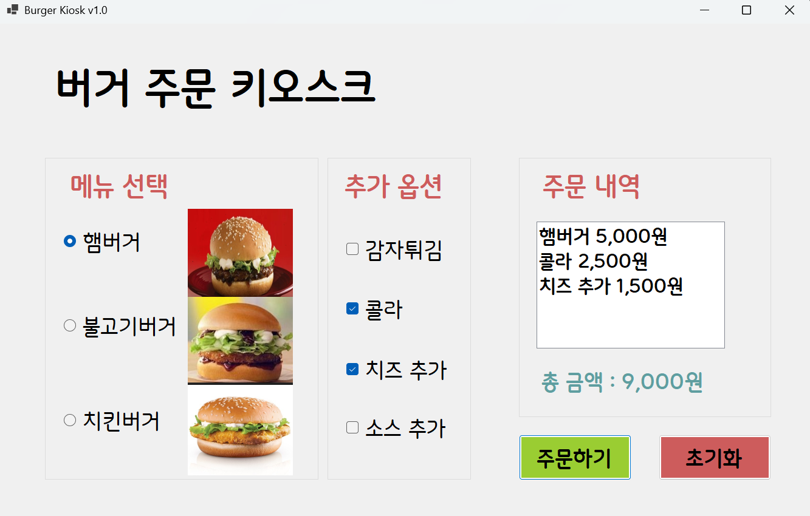
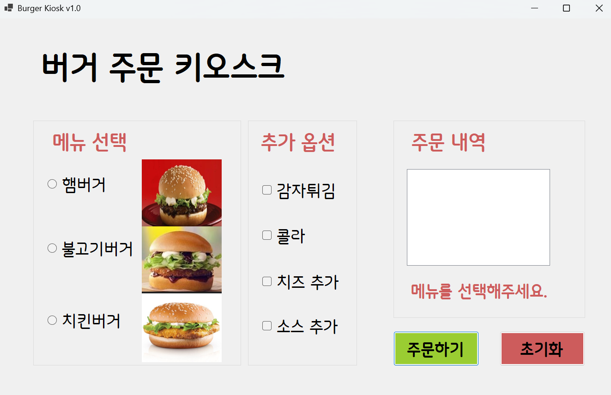
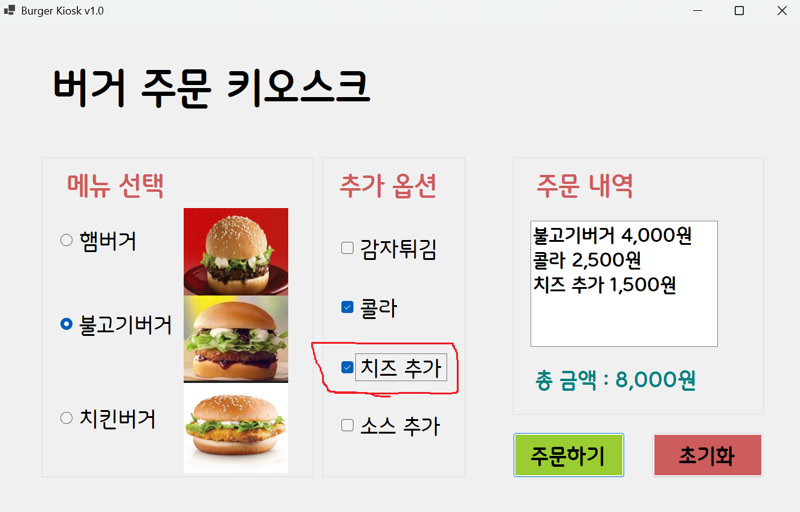
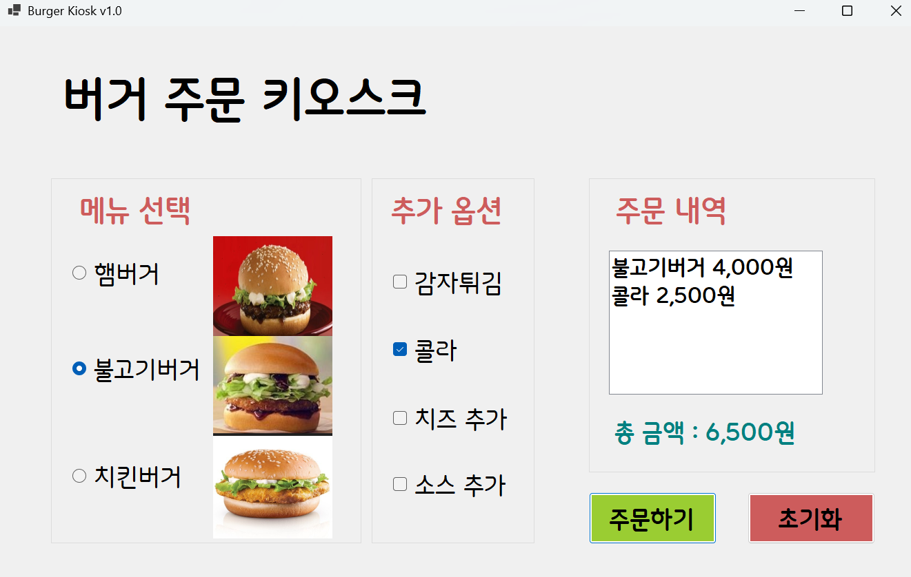

# (C# 코딩) <버거 주문 키오스크>

## 개요
- C# 프로그래밍학습
- 1줄소개: 버거와 추가옵션(사이드)을 원하는 대로 주문하는 키오스크를 만듭니다.
- 사용한플랫폼: 
  - C#, .NET Windows Forms, Visual Studio, GitHub
- 사용한컨트롤:
  - Label, GroupBox, PictureBox, CheckBox, RadioButton, ListBox
- 사용한기술과구현한기능:
 - 메뉴를 선택하지 않았을 때 메뉴를 선택해달라는 에러메세지가 라벨로 표현되도록 구현했습니다.(사용자 편의성)
 - 마우스 없이 키보드 입력만으로 주문이 가능하도록 구현했습니다.
 - RadioButton과 CheckBox에서 원하는 항목을 선택하면 그 즉시 정보들이 업데이트 되도록 구현했습니다.

## 실행화면(과제1)
- 과제1코드의실행스크린샷

- 과제내용
 - UI 구성
 - 주문하기 버튼과 초기화 버튼의 기능 구현

- 구현내용과기능설명
 	- RadioButton과 CheckBox를 적절히 배치합니다.
	- GroupBox로 적절하게 그룹으로 묶습니다.
    - 주문 내역과 총 금액을 표시합니다. 
	- 다시 주문할 수 있도록 초기화 합니다. 

## 실행화면(과제2)
- 과제2코드의실행스크린샷

- 과제내용
 - 아무것도 선택하지 않고 주문하기 버튼을 눌렀을 때 에러 메시지가 표시되도록 구현했습니다.

-구현내용과기능설명
 - MessageBox를 사용하기보다는 Label 사용하여 사용자 편의성을 향상시켰습니다.

## 실행화면(과제3)
- 과제3코드의실행스크린샷

- 과제내용
 - 마우스 없이 키보드 입력만으로 주문이 가능하도록 구현했습니다.

- 구현내용과기능설명
   - Tab키를 이용해서 GroupBox 사이를 이동할 수 있도록 구현했습니다.
   - 방향키를 이용해서 선택 아이템 사이를 이동할 수 있도록 구현했습니다.
   - 스페이스바를 이용해서 메뉴를 선택할 수 있도록 구현했습니다.
   - Enter키를 눌러 주문 내역에 입력이 되도록 구현했습니다.

## 실행화면(과제4)
- 과제4코드의실행스크린샷

- 과제내용
 - RadioButton과 CheckBox에서 원하는 항목을 선택하면 그 즉시 정보들이업데이트 되도록 구현했습니다.

- 구현내용과기능설명
  - 선택하는 순간 ListBox에 주문내역이 표시되도록 구현했습니다.
     - (예시) 햄버거 53,000원
              콜라 2,500원
  - 선택하는 순간 Label에 전체 가격정보가 표시되도록 구현했습니다.
     - (예시) 총 금액 : 7,500원
